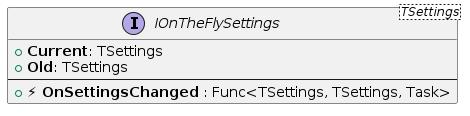
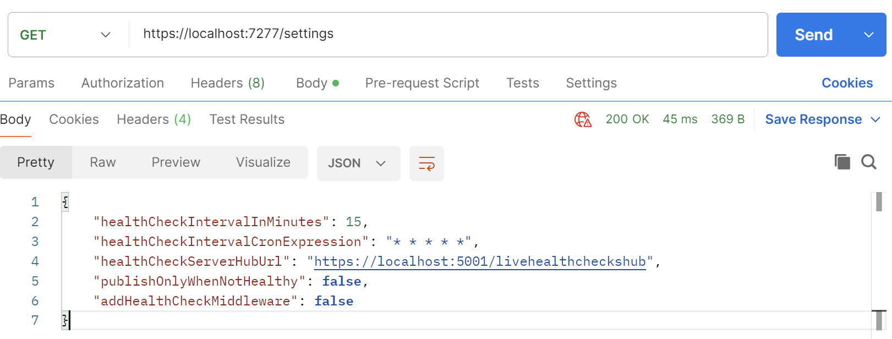
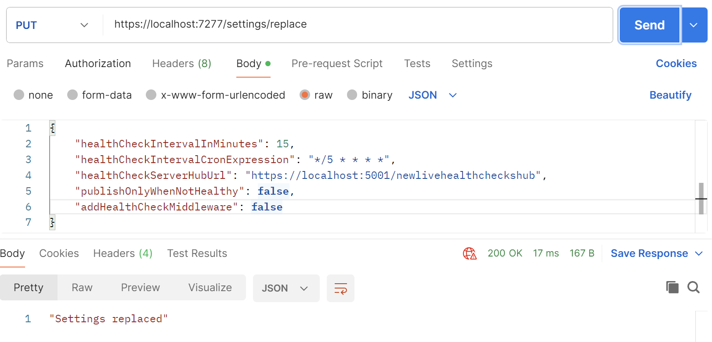

# OnTheFlySettings

[](https://github.com/VeritasSoftware/OnTheFlySettings/actions/workflows/dotnet.yml)

### Supports .NET 6/7/8/9/10.

This project is a AspNetCore library that provides a way to `update API/App settings on-the-fly`.

### Zero downtime! At runtime! No need to restart your API/App!

It supports `various settings sources`.

You add the library to your project by adding the NuGet package:

```bash
dotnet add package OnTheFlySettings
```
or
```bash
Install-Package OnTheFlySettings
```

## Plugging in the framework

### Create settings section

Create a section in your appsettings.json for the settings that you want to update on-the-fly:

```json
{
  "MyHealthCheckBasicSettings": {
    "HealthCheckIntervalInMinutes": 15,
    "HealthCheckIntervalCronExpression": "* * * * *",
    "HealthCheckServerHubUrl": "https://localhost:5001/livehealthcheckshub",
    "PublishOnlyWhenNotHealthy": false,
    "AddHealthCheckMiddleware": false
  },
  "Logging": {
    "LogLevel": {
      "Default": "Information",
      "Microsoft.AspNetCore": "Warning"
    }
  }
}
```

### Create settings class

Create a settings class called `MyHealthCheckBasicSettings` in your application:

```csharp
public class MyHealthCheckBasicSettings
{
    public int HealthCheckIntervalInMinutes { get; set; }
    public string HealthCheckIntervalCronExpression { get; set; }
    public string HealthCheckServerHubUrl { get; set; }
    public bool PublishOnlyWhenNotHealthy { get; set; }
    public bool AddHealthCheckMiddleware { get; set; }
}
```

### Configuring the library

Then you can configure the library in your `Startup.cs` or `Program.cs` file.

Bind the section to the settings class & add to OnTheFlySettings framework:

```csharp
using OnTheFlySettings;
```

```csharp
var builder = WebApplication.CreateBuilder(args);

builder.Configuration
       .SetBasePath(Directory.GetCurrentDirectory())
       .AddJsonFile("appsettings.json", false, true);

var appBasicSettings = builder.Configuration.GetSection("MyHealthCheckBasicSettings")
                                            .Get<MyHealthCheckBasicSettings>();

if (appBasicSettings == null)
    throw new ApplicationException("Settings not found.");

// Add the settings to the OnTheFlySettings framework
builder.Services.AddOnTheFlySettings(appBasicSettings);
```

Thats it!

## Usage in your API/App

The library provides a `IOnTheFlySettings<T>` interface that you use in your API/App.



### Events

The interface has an event `OnSettingsChanged`.

You can subscribe to the event in your own class, for example in a service class.

Just inject the `IOnTheFlySettings<T>` interface into your class and subscribe to the event:

```csharp
private readonly IOnTheFlySettings<MyHealthCheckBasicSettings> _settingsHolder;

// Constructor
public MyService(
                    IOnTheFlySettings<MyHealthCheckBasicSettings> settingsHolder
                )
{            
    _settingsHolder = settingsHolder;
    _settingsHolder.OnSettingsChanged += SettingsHolder_OnSettingsChanged;
}

private async Task SettingsHolder_OnSettingsChanged(MyHealthCheckBasicSettings oldSettings, MyHealthCheckBasicSettings newSettings)
{
    // Handle the settings change event here
}
```

or

you can also subscribe to the event in your `Startup.cs` or `Program.cs` file:

```csharp
var settingsHolder = app.Services.GetRequiredService<IOnTheFlySettings<MyHealthCheckBasicSettings>>();

settingsHolder.OnSettingsChanged += async (oldSettings, newSettings) =>
{
    // Handle the settings change event here
};
```

### Accessing Current Settings

The interface has `Current` & `Old` properties to access the current & previous settings.

#### Using dependency injection

You can also use the interface to access the current settings at any time:

```csharp
var basicSettings = _serviceProvider.GetRequiredService<IOnTheFlySettings<MyHealthCheckBasicSettings>>().Current;
```

or

via constructor injection in your class:

```csharp
private readonly MyHealthCheckBasicSettings _basicSettings;

// Constructor
public MyService(
                    IOnTheFlySettings<MyHealthCheckBasicSettings> settingsHolder
                )
{            
    _basicSettings = settingsHolder.Current;
}
```

#### Using global variable

Create a static Globals class in your application.

```csharp
public static class Globals
{
    public static MyHealthCheckBasicSettings? BasicSettings { get; set; }
}
```

Then, subscribe to `OnSettingsChanged` event in your `Program.cs` or `Startup.cs`.

Update the Globals property in the event handler.

```csharp
var settingsHolder = app.Services.GetRequiredService<IOnTheFlySettings<MyHealthCheckBasicSettings>>();

settingsHolder.OnSettingsChanged += async (oldSettings, newSettings) =>
{
    lock(_lockObj)
    {
        Globals.BasicSettings = newSettings;
    }
};
```

Use `Globals.BasicSettings` in your code.

## Endpoints - read/update settings on-the-fly

Library provides Minimal API endpoints for managing settings, including reading, and updating settings.

You can secure these endpoints using authentication and authorization mechanisms provided by ASP.NET Core.

To add the endpoints to your application, you can use the following code in your `Startup.cs` or `Program.cs` file:

```csharp
app.MapGetOnTheFlySettings()
   .RequireAuthorization(); // Provide your own authorization policy here
							// or remove this line to allow anonymous access.

app.MapPutReplaceOnTheFlySettings()
   .RequireAuthorization(); // Provide your own authorization policy here
							// or remove this line to allow anonymous access.
```

Default routes to the endpoints are:

- GET /settings

- PUT /settings/replace

but you can customize the routes by providing your own route templates:

```csharp
app.MapGetOnTheFlySettings("/my-custom-route")
   .RequireAuthorization(); // Provide your own authorization policy here
							// or remove this line to allow anonymous access.

app.MapPutReplaceOnTheFlySettings("/my-custom-route/replace")
   .RequireAuthorization(); // Provide your own authorization policy here
							// or remove this line to allow anonymous access.
```

### Get settings



### Replace settings

