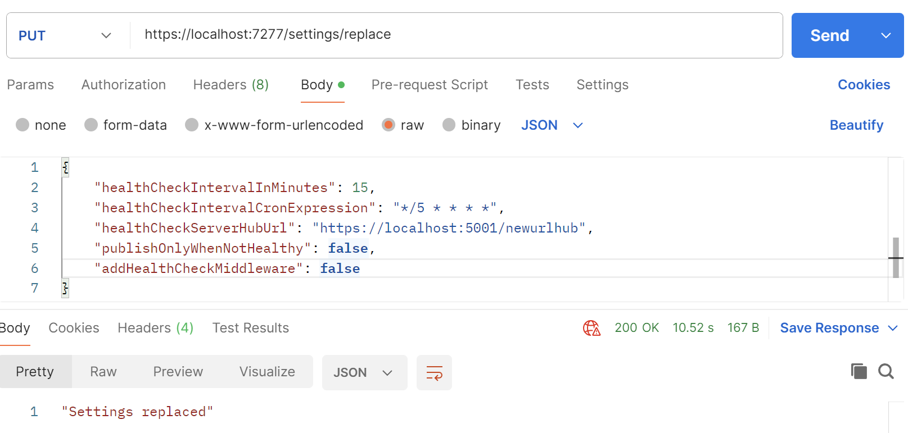

# AspNetCore.OnTheFlySettings

This project is a AspNetCore library that provides a way to `update settings on-the-fly`.

You can use this library to manage your application settings dynamically `without the need to restart your application`. 

It supports `various settings sources` and allows you to update settings `at runtime`.

You add the library to your project by adding the NuGet package:

```bash
dotnet add package AspNetCore.OnTheFlySettings
```
or
```bash
Install-Package AspNetCore.OnTheFlySettings
```

## Usage

Let's say you have a settings class called `MyHealthCheckBasicSettings` in your application,

where you put all the settings that you want to update on-the-fly:

```csharp
public class MyHealthCheckBasicSettings
{
    public int HealthCheckIntervalInMinutes { get; set; }
    public string HealthCheckIntervalCronExpression { get; set; }
    public string HealthCheckServerHubUrl { get; set; }
    public bool PublishOnlyWhenNotHealthy { get; set; }
    public bool AddHealthCheckMiddleware { get; set; }
}
```

### Optional: Adding more settings

You can derive another settings class from `MyHealthCheckBasicSettings` to add more settings, that need not be updated on-the-fly, 

but you want to keep them in the same settings class.

```csharp
public class MyHealthCheckSettings : MyHealthCheckBasicSettings
{
    public string ClientId { get; set; } = string.Empty;
    public string ReceiveMethod { get; set; } = string.Empty;
    public string SecretKey { get; set; } = string.Empty;
    public Func<HealthReport, object>? TransformHealthReport { get; set; } = null;        
}
```

## Configuring the library

Then you can configure the library in your `Startup.cs` or `Program.cs` file:

```csharp
using AspNetCore.OnTheFlySettings;
```

```csharp
var onTheFlySettingsHolder = services.AddOnTheFlySettings<MyHealthCheckBasicSettings>(settings =>
{
    settings.HealthCheckIntervalInMinutes = mySettings.HealthCheckIntervalInMinutes;
    settings.HealthCheckIntervalCronExpression = mySettings.HealthCheckIntervalCronExpression;
    settings.HealthCheckServerHubUrl = mySettings.HealthCheckServerHubUrl;
    settings.PublishOnlyWhenNotHealthy = mySettings.PublishOnlyWhenNotHealthy;
    settings.AddHealthCheckMiddleware = mySettings.AddHealthCheckMiddleware;
});
```

`mySettings` is an instance of `MyHealthCheckSettings` that you have optionally created.

or you can just set the values of the `settings` directly in the `AddOnTheFlySettings` method.

## Events

You can listen to the `OnSettingsChanged` event to get notified when settings are updated:

```csharp
onTheFlySettingsHolder.OnSettingsChanged += async (oldSettings, newSettings) =>
{
    // Handle the settings change event here
};
```

## Accessing Current Settings

You can also use the `IOnTheFlySettings<T>` interface to access the current settings at any time:

```csharp
var basicSettings = _serviceProvider.GetRequiredService<IOnTheFlySettings<MyHealthCheckBasicSettings>>().Current;
```

## Endpoints - read/update settings on-the-fly

Library provides Minimal API endpoints for managing settings, including reading, and updating settings.

You can secure these endpoints using authentication and authorization mechanisms provided by ASP.NET Core.

To add the endpoints to your application, you can use the following code in your `Startup.cs` or `Program.cs` file:

```csharp
app.MapGetOnTheFlySettings()
   .RequireAuthorization(); // Provide your own authorization policy here
							// or remove this line to allow anonymous access.

app.MapPutReplaceOnTheFlySettings()
   .RequireAuthorization(); // Provide your own authorization policy here
							// or remove this line to allow anonymous access.
```

Default routes to the endpoints are:

- GET /settings

- PUT /settings/replace

but you can customize the routes by providing your own route templates:

```csharp
app.MapGetOnTheFlySettings("/my-custom-route")
   .RequireAuthorization(); // Provide your own authorization policy here
							// or remove this line to allow anonymous access.

app.MapPutReplaceOnTheFlySettings("/my-custom-route/replace")
   .RequireAuthorization(); // Provide your own authorization policy here
							// or remove this line to allow anonymous access.
```


